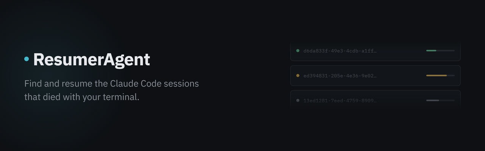
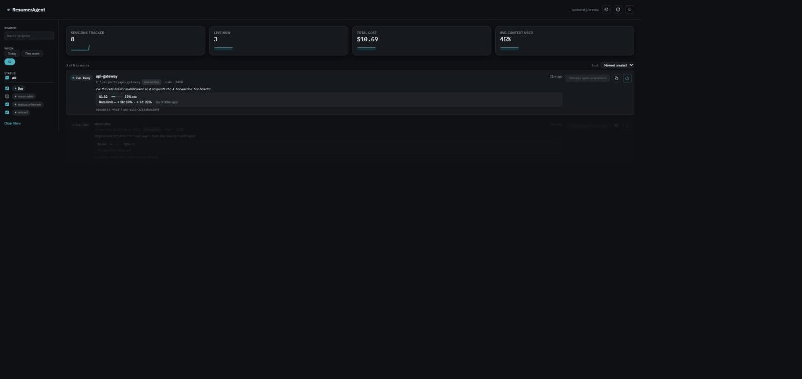
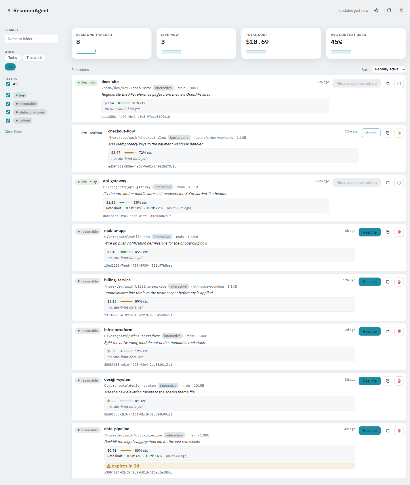

<p align="center">
  
</p>

<p align="center">
  <a href="LICENSE"></a>
  <a href="#install--quickstart">=18" /></a>
  <a href="#cross-platform-support"></a>
  <a href="https://github.com/Arman-no/ResumerAgent/actions/workflows/tests.yml"></a>
</p>

<p align="center">
  <strong>A local dashboard that finds Claude Code sessions <code>claude agents</code> can't see — the ones that died when a terminal closed — and resumes them with one click.</strong>
</p>

<p align="center">
  <a href="#the-problem">The Problem</a> &middot;
  <a href="#what-you-get">Features</a> &middot;
  <a href="#how-it-works">How it works</a> &middot;
  <a href="#install--quickstart">Install</a> &middot;
  <a href="#configuration">Configuration</a> &middot;
  <a href="#safety-model">Safety</a> &middot;
  <a href="#faq">FAQ</a>
</p>

---

ResumerAgent is a small local dashboard for finding and resuming Claude Code
sessions — especially the ones that die when a terminal closes or the
machine shuts down and would otherwise be lost. Claude Code already ships
`claude agents`, a terminal dashboard for every *live* session across every
directory. ResumerAgent covers what that doesn't: dead interactive
sessions, shown alongside the live ones, in a browser, with one click to
reopen a terminal on the right one.

**Handing this to a colleague, or to a Claude Code agent on another
machine?** Point them at `AGENT_SETUP.md` instead of this file — it's
written as install + self-troubleshooting instructions for an agent to
follow directly, including the machine-specific gotchas (AppLocker,
`SESSIONS_ROOT` detection) already hit once on the original dev machine.

<p align="center">
  
  <br />
  <em>Narrowing to the live sessions, copying a resume command to the clipboard, and switching themes.</em>
</p>

## The problem

Claude Code's own `claude agents` only shows *live* sessions. The moment a
session's terminal closes, or the machine restarts, it drops out of that
list entirely — even though its transcript, and its ability to resume,
still exist on disk. There's no way to see it's there from Claude Code's
own tooling.

Compounding that: Claude Code auto-deletes a session's transcript once it
goes stale. On every `claude` startup it computes a cutoff
(`now - cleanupPeriodDays`, default 30 days, read from `settings.json`) and
deletes any `.jsonl` older than that — silently, with no warning, no
trash, and no recovery path (confirmed against multiple upstream reports:
anthropics/claude-code issues #62959, #59248, #62476, #64999). A session
you park for a few weeks and mean to come back to can be gone with zero
notice.

ResumerAgent exists to make both of those visible: dead sessions found and
made resumable again, and a warning before Claude Code's own cleanup
deletes one out from under you.

## What you get

- **Live + dead, one list.** Merges `claude agents --json --all` (live
  background jobs) with a scan of transcript `.jsonl` files (everything,
  live or dead) and the session registry (`sessions/<pid>.json`) — the
  registry is a secondary cross-check only, not the primary source: it's
  deleted on a normal clean exit, so `claude agents` is what actually
  decides `live`.
- **Sorting.** Sorted by created-at, newest first, by default; switchable
  from the toolbar.
- **No Name fallback.** A session with no `/rename` and no recoverable
  transcript title shows as "No Name" rather than a blank row — you can
  still tell them apart by cwd, last-message preview, and age.
- **Last message / recap preview.** Each row shows the last thing you
  actually typed, or the away-summary recap if Claude Code generated one.
- **Retired duplicates ("superseded").** If you rename a new session to
  the same name as an old, larger one you're done with, the old one is
  kept in the list (so you can still find and purge it) but marked "moved
  to a newer session" and its Resume button disabled — it can never be
  resumed by accident, and its transcript stops growing.
- **Fail-closed safety.** If liveness can't be confirmed, Resume/Attach/
  Purge are refused outright rather than guessed at. See
  [Safety model](#safety-model) below for the full rundown.
- **Copy resume command.** Every session row has a copy button (it
  renders even on rows where Resume is disabled) that puts the resume
  command on the clipboard instead of spawning a terminal — the fallback
  for SSH, tmux, or a terminal this tool doesn't know how to drive.
- **Session expiry warning.** Any session within 5 days of Claude Code's
  own `cleanupPeriodDays` cutoff gets a `⚠ expires in Nd` badge, switching
  to `⚠ expires imminently` once it hits zero days left; everything else
  shows no badge at all. This is a warning only, not a guard — it can't
  stop or delay Claude Code's own cleanup, which runs independently at
  `claude` startup.
- **Dark/light theme.** Toggle in the header, defaults to dark, persisted
  in `localStorage` and applied before first paint (no flash of the wrong
  theme).
- **Pause a live background job.** A live *background* session (started
  with `claude --bg`, the only kind with a stoppable id) gets a Pause
  button next to Attach, two-click confirm like Purge. It runs Claude
  Code's own `claude stop <id>` — not a process kill this app invented —
  so `claude attach <id>` or `claude --resume` both work again once it's
  stopped. See `docs/2026-09-13-pause-session-design.md`.
- **Close a live interactive session.** A live interactive session (a
  terminal someone has open — the case Pause can't cover) gets a Close
  (✕) button instead, same two-click confirm. Ends the session's whole
  process tree, not just the top-level process — on Windows via
  `taskkill /PID <pid> /T /F`; on macOS/Linux via a `ps` read to find the
  identity/parent/descendant tree followed by a single `kill`
  (`lib/closeSession.mjs`). Verified live on Windows that the parent
  terminal window survives and the session stays resumable afterward; the
  macOS/Linux path is unit-tested only, not yet run on real hardware.
- **Parent/child hierarchy for parked background jobs.** An interactive
  session that parks a background job under it (Claude Code's own
  `parkedJobId` field) drops out of `claude agents --json --all` entirely,
  even while genuinely alive. The parent row shows a "parent" badge, an
  inline summary of the child's real status, the child's own working
  Attach button, and a "▸ details" toggle that nests the full child row
  underneath.

### Activity panel

Four headline stat cards above the session list — Sessions tracked, Live
now, Total cost, Avg context used — each with a small inline sparkline.
Honest caveat: only *Sessions tracked* has a real trend behind its
sparkline (a genuine 14-day daily count from each session's own
`createdAt`). This tool has never persisted a time-series of its own
aggregate stats, so the other three are point-in-time snapshots
recomputed on every poll, and their sparklines are honestly flat rather
than a fabricated trend.

Each session row also gets a small activity strip:

- **Cost so far** and **context-window used %**, color-coded at the same
  <70 / 70–89 / ≥90 thresholds as a Claude Code statusline. Sourced by
  default from a backward tail-scan of the session's own transcript
  `.jsonl` (`lib/transcriptPreview.mjs`).
- **Rate limits** (5h / 7d used %, with an "as of" freshness note) — from
  one place only: an optional statusline sidecar JSON file at
  `<SESSIONS_ROOT>/activity/<sessionId>.json`, written by your own
  `statusline.ps1` (or equivalent). There's no transcript equivalent for
  rate-limit data. The sidecar is entirely optional — most installs won't
  have one, and the dashboard degrades gracefully without it.

## Screenshots

<picture>
  <source media="(prefers-color-scheme: dark)" srcset="docs/images/dashboard-dark.png">
  
</picture>

*Example sessions — the screenshot is generated from seeded data, not a
real machine.*

## How it works

Short version: it reads Claude Code's own per-session registry files plus
`claude agents --json --all` and a scan of every transcript on disk, merges
the three, and shows one dashboard.

```
  claude agents --json --all      sessions/<pid>.json         projects/**/*.jsonl
     (live background jobs —         (per-session registry —      (every session's
      the source of truth for        secondary cross-check,        transcript: title,
      "is it live")                  deleted on clean exit)         last message, cost,
                                                                     context %)
              \                              |                              /
               \                             |                             /
                \____________________________|____________________________/
                                              |
                                    lib/mergeSessions.mjs
                                              |
                              one list: live + dead sessions, each
                           tagged liveUnknown / superseded / safe, feeding
                                  the fail-closed action gate below
```

See `docs/2026-09-09-session-dashboard-design.md` for the full design
history — it grew through many small revisions as real bugs were found,
and explains the *why* behind each check, not just the *what*.

**Architecture diagrams:** generated with the
[archify](https://github.com/tt-a1i/archify) skill — see
`docs/diagrams/architecture.html` and `docs/diagrams/resume-sequence.html`.
Stale as of 2026-09-13: they predate the activity panel, expiry warning,
and the pause/close features.

## Install & quickstart

```bash
git clone https://github.com/Arman-no/ResumerAgent.git
cd ResumerAgent
npm install             # no-op: zero runtime dependencies, just confirms Node works
cp .env.example .env    # optional — only needed if your setup isn't a default native install
npm start
```

This starts a server on `http://127.0.0.1:4317` and opens it in your
browser. `Ctrl+C` to stop; nothing runs when you're not using it. `pnpm`
works equally well if that's what you use instead of `npm`.

**Desktop shortcut:** point it at `npm run launch` instead of `npm start`
— specifically `npm`, even if you use `pnpm` for everything else. `launch`
stops any previous ResumerAgent instance still bound to the port before
starting a fresh one; plain `start` will silently keep an old instance
running if one is already there. See
[Troubleshooting](#troubleshooting) if you're on a locked-down Windows
machine and hit AppLocker trying to use pnpm.

## Configuration

Everything below is optional, set via `.env` (see `.env.example`) or your
shell:

| Variable | Default | What it does |
|---|---|---|
| `SESSIONS_ROOT` | `$CLAUDE_CONFIG_DIR`, then `~/.claude` | Directory containing Claude Code's `sessions/` and `projects/` folders. |
| `RESUME_COMMAND` | `claude --resume {sessionId}` | Command template run when you click Resume. Placeholders: `{cwd}`, `{sessionId}`, `{id}`. |
| `ATTACH_COMMAND` | `claude attach {id}` | Command template run when you click Attach. Same placeholders. |
| `TERMINAL_COMMAND` | per-OS auto-detect (see [Cross-platform support](#cross-platform-support)) | Overrides how Resume/Attach opens a terminal window. Placeholders: `{command}`, `{title}`, `{cwd}`. |
| `PORT` | `4317` | Port for the local dashboard server. |

**Running Claude Code through Docker?** Your session files live inside the
container. If your container mounts its Claude config directory to a host
path, set `SESSIONS_ROOT` to that host path, and point
`RESUME_COMMAND`/`ATTACH_COMMAND` at whatever actually invokes `claude` for
you, e.g.:

```
RESUME_COMMAND=docker exec -it my-claude-container claude --resume {sessionId}
ATTACH_COMMAND=docker exec -it my-claude-container claude attach {id}
```

## Safety model

- `liveUnknown` sessions (liveness couldn't be determined) are refused for
  every action, both client-side (button disabled, no click handler) and
  server-side (`canSafelyAct()` in `server.mjs`) — independently, so a bug
  in one layer doesn't silently rely on the other.
- Every `/api/resume`, `/api/purge`, `/api/pause`, and `/api/close`
  request re-derives the session's current state server-side from a fresh
  lookup; the client's request body is only ever a `sessionId` key, never
  trusted for anything safety-relevant.
- `superseded` sessions are refused for Resume — not because resuming an
  old session is unsafe, but because it's exactly the action that would
  grow a transcript you're trying to retire.
- `/api/pause` reuses the same `canSafelyAct()` allowlist Attach already
  requires (live, not `liveUnknown`, not `superseded`, `kind ===
  'background'`, a real `id`).
- `/api/close` mirrors the same guard ordering but inverts the kind check
  (`kind === 'interactive'`, a real `pid`) — plus one more check right
  before acting: the target pid must still resolve to a real `claude`
  process, guarding specifically against PID reuse, since ending a
  silently-recycled PID has no safe undo.

**Never test `/api/resume`, `/api/purge`, `/api/pause`, or `/api/close`
against real session data you care about** — use synthetic `.jsonl`
fixtures, or a disposable `claude --bg` job or a disposable interactive
session you don't mind ending, never a real one.

## Cross-platform support

Resume/Attach spawn a terminal window the way each OS actually supports:
`cmd.exe`/`start` on Windows, Terminal.app via `osascript` on macOS, and on
Linux the first installed emulator out of `x-terminal-emulator`,
`gnome-terminal`, `konsole`, `xfce4-terminal`, `alacritty`, `kitty`,
`xterm` (see `lib/terminalCommand.mjs`). No supported emulator found, or
you want a specific one — iTerm, WezTerm, Warp, tmux — on any OS? Set
`TERMINAL_COMMAND` (see [Configuration](#configuration)). Every session
row also has a copy button that puts the resume command on the clipboard,
which works no matter what: the fallback for SSH, tmux, or a terminal this
tool doesn't know how to drive.

**The Windows path is the one exercised on real hardware; macOS and Linux
are covered by unit tests with the platform and PATH probe injected, not
yet run on real machines.**

## Troubleshooting

`AGENT_SETUP.md` has a symptom → cause → fix table covering the issues
actually hit on real machines so far: AppLocker/corepack blocking `pnpm`,
an empty or wrong session list from a misresolved `SESSIONS_ROOT`,
`EADDRINUSE` on `npm start`, Resume opening nothing on macOS/Linux, and
more. It's written as self-troubleshooting instructions for an agent (or
you) to follow directly rather than guess — start there instead of this
file.

## FAQ

### What does ResumerAgent do that `claude agents` doesn't?

`claude agents` only shows live sessions. ResumerAgent adds every dead
one too — found by scanning transcript `.jsonl` files — in the same list,
with a one-click Resume.

### Does it stop Claude Code from deleting old sessions?

No. The expiry badge is a warning only; it can't intercept or delay
Claude Code's own `cleanupPeriodDays` cleanup, which runs independently at
`claude` startup, outside this tool's process.

### Is it safe to click Resume/Attach/Purge on the wrong row?

The fail-closed model refuses any action where liveness can't be
confirmed, and every action re-derives session state server-side rather
than trusting the click. It doesn't prevent you from purging a session
you didn't mean to, though — purge still does what you told it to.

### Does this work over SSH or inside tmux?

The terminal-spawn buttons (Resume/Attach) assume a local terminal
emulator. Over SSH or in tmux, use the copy-command button on that row
instead — it puts the same resume command on the clipboard.

### What's the difference between Pause and Close?

Pause is for a *background* job (`claude --bg`) and runs Claude Code's own
`claude stop <id>` — fully resumable by design. Close is for a live
*interactive* session (a terminal someone has open) and ends its whole
process tree, since Claude Code exposes no native stop for that case.

### Does ResumerAgent send my data anywhere?

No. It has zero runtime dependencies (`node:http`, `node:fs`,
`node:child_process` only) and serves a local dashboard on
`127.0.0.1`. Everything it reads comes from your own `SESSIONS_ROOT`.

### Can I use pnpm instead of npm?

Yes, for every command in this README. The one exception is a desktop
shortcut, which should still invoke `npm run launch` specifically — see
[Install & quickstart](#install--quickstart) for why.

### Does this actually work on macOS and Linux?

The code paths exist and are unit-tested with the platform and PATH
probes injected, but only the Windows path has run on real hardware so
far. See [Cross-platform support](#cross-platform-support).

### What if I run Claude Code inside Docker?

Point `SESSIONS_ROOT` at the host path your container mounts its Claude
config directory to, and set `RESUME_COMMAND`/`ATTACH_COMMAND` to a
`docker exec` invocation. See [Configuration](#configuration) for the
exact example.

## Contributing

Zero runtime and dev dependencies, so there's no install step for
development either — `node --test` runs the full suite locally, the same
command `.github/workflows/tests.yml` runs in CI across
ubuntu/macos/windows × Node 18/22, on every push to `master`/`development`
and every pull request.

`master` is the feature-complete branch. If you're touching
`public/styles.css` or adding any UI, read `MASTER.md` first — it's the
single source of truth for this app's color tokens, typography, spacing,
and interaction rules; don't reintroduce a one-off hex value or re-derive
a rule it already settled. And per the [Safety model](#safety-model)
above: never run `/api/resume`, `/api/purge`, `/api/pause`, or
`/api/close` against real session data while testing a change.

## License

MIT — see [LICENSE](LICENSE).
